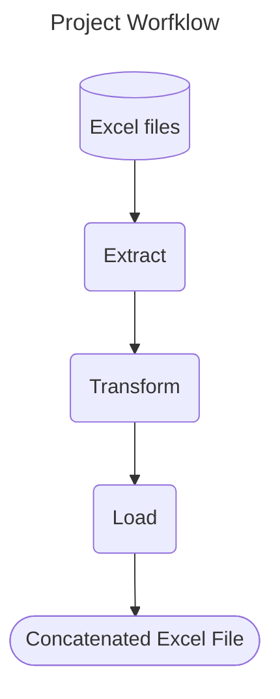

# Project Layout

For full documentation visit [my GitHub repo](https://github.com/felipesebben/workshop-structure).

## Workflow

# Function that tranforms the data #

### ::: app.pipeline.extract.extract_from_excel
